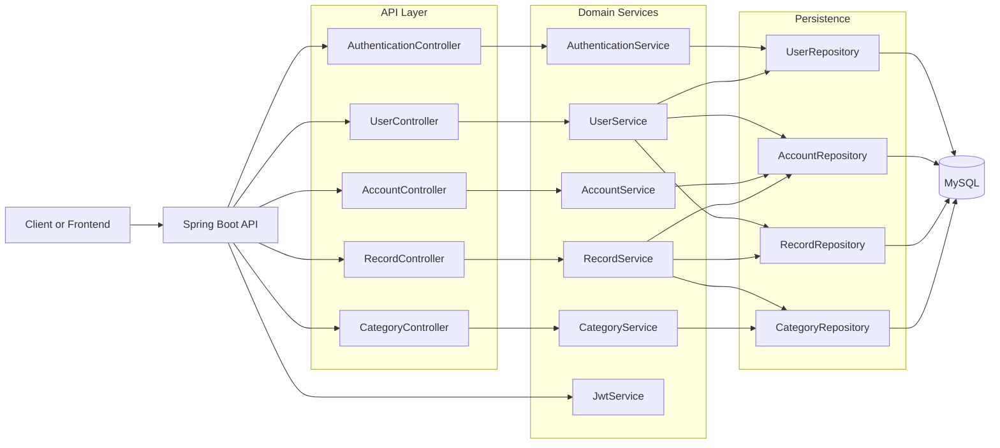
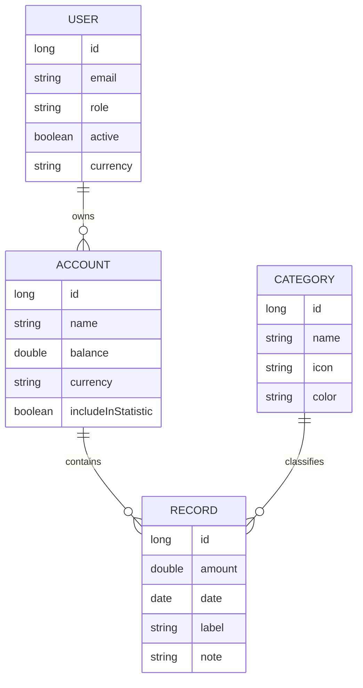

# Finance Dashboard - Backend

[](https://www.java.com/en/)
[](https://spring.io)
[](https://maven.apache.org)
[](https://www.mysql.com)
[](https://swagger.io)
[](https://www.docker.com)

## 📝 Description

Finance Dashboard is an enterprise-grade RESTful API backend for **managing personal finances**. It allows users and analysts to securely categorize records, analyze income and expenses, and manage multiple financial accounts using stateless JWT authentication and role-based access control.

The backend was completely written in **Java 17** using the **Spring Boot framework** and utilizes a MySQL database for scalable data persistence. The application acts as the data provider to a frontend application, securely connected via a robust REST API.

## 🔗 Links

- [🚀 Live API URL (Render)](https://finance-dashboard-be-1.onrender.com/api)
- [📄 API documentation (Swagger)](https://finance-dashboard-be-1.onrender.com/api/swagger-ui/index.html)

## ⚽️ Project Goals

This project was created to **design a robust layered architecture** and to deploy scalable backend systems to modern cloud providers (Render & Railway). Additionally, I aimed to demonstrate enterprise-level capabilities such as RBAC (Role-Based Access Control) matrix validation, JWT authentication, centralized exception handling, and automated API documentation.

## 🏗️ Realization

I developed the **backend** in **Java 17** and the **Spring Boot** framework, choosing a robust MySQL database for data persistence. The application utilizes a highly separated **MVC architecture** (Controller-Service-Repository). The database and the backend app are containerized to run in **Docker** via multi-stage builds. Authentication and authorization strictly enforce security rules through **JWT tokens** natively relying on **Spring Security**. 

The API securely integrates dynamic filtering, sorting, and analytical endpoint processing. It also automatically generates interactive **OpenApi (Swagger)** documentation based on the codebase.

### Architecture Overview



### Domain Model



## 🚀 Features

- **Role-based Authentication:** Enforces permissions via `USER`, `ANALYST`, and `ADMIN` roles.
- **Multiple financial accounts:** Manage boundaries between different account ledgers.
- **Dynamic Categorization:** Add expense/income records safely mapped to personal categories.
- **Granular Data Analytics:** Analytical calculation of incomes, expenses, categories, and balance evolution.
- **Centralized Validation & Exception Handling:** Strict `400/401/403/404` customized error payloads via `@RestControllerAdvice`.
- **Advanced Filtering/Sorting:** Dynamically retrieve records via specifications (`dateGe`, `amountGt`, `categoryId`).

## 🧑‍🔬 Technologies

- [Java 17](https://www.java.com/en/)
- [Spring Boot 3.0.2](https://spring.io)
- [Maven](https://maven.apache.org)
- [Docker](https://www.docker.com)
- [MySQL](https://www.mysql.com)
- [Spring Security (JWT)](https://spring.io/projects/spring-security)
- [Springdoc OpenAPI](https://swagger.io/)

## 😁 Conclusion

This backend rapidly evolved into a scalable and enterprise-like service payload. I gained advanced architectural knowledge regarding **JWT Stateless Filtering**, enforcing environment overrides dynamically using Spring Profiles (`dev` vs `prod`), resolving multi-stage **Docker** container configurations for deployment, and managing secure cloud environments connecting Render to decentralized managed database clusters on Railway.

## ✅ Software requirements

- Java 17+
- Maven wrapper (included)
- Docker & Docker Compose (for local database setup)

## 🎬 How to run

### Clone repository

```bash
git clone https://github.com/your-username/FinanceDashboard-BE.git
cd FinanceDashboard-BE/
```

### Start database

```bash
docker compose up -d db
```

### Start the app

- Set the development environment. The app will connect to the local database.
- Create the database schema by ensuring `./src/main/resources/application-dev.yml` contains `spring.jpa.hibernate.ddl-auto: update`.
- Run the app (app will run and host the API base path at http://localhost:8000/api)
    ```bash
    ./mvnw spring-boot:run -Dspring-boot.run.profiles=dev
    ```
    (On Windows: `.\mvnw.cmd spring-boot:run "-Dspring-boot.run.profiles=dev"`)

- Seeded `dev` profile Users:
  - `admin@gmail.com` / `12345678` (ADMIN)
  - `analyst@gmail.com` / `12345678` (ANALYST)

- Swagger documentation of the running app can be found locally at:
  http://localhost:8000/api/swagger-ui/index.html

## 🎆 Endpoints Structure (High Level)

Base path: `/api`

### Public Endpoints
- `GET /api` - server status check
- `POST /api/auth/register` - register a user
- `POST /api/auth/authenticate` - login to retrieve JWT

*All other domains (`/users`, `/accounts`, `/records`, `/categories`) require passing the JWT Token in the Authorization Header: `Bearer <token>`.*