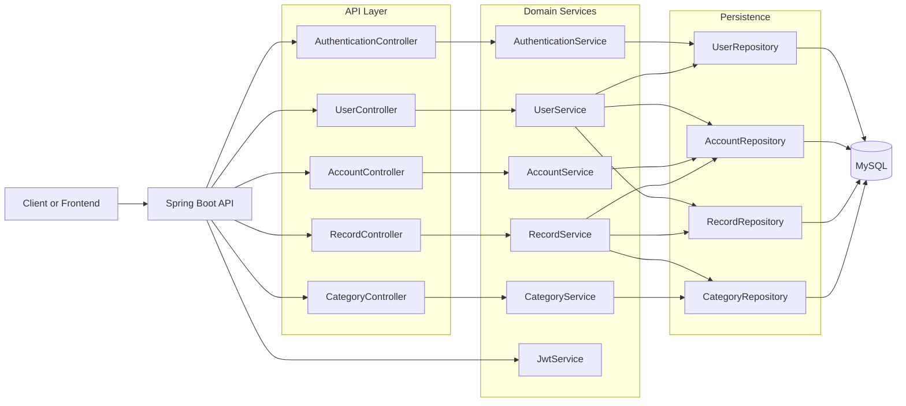
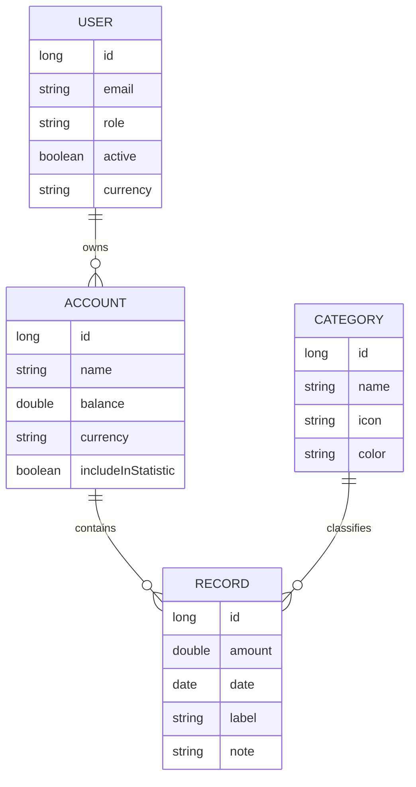

# Finance Dashboard Backend

A layered Spring Boot backend for a finance dashboard domain with JWT authentication, role-based access control, analytics endpoints, validation, and MySQL persistence.

## What This Backend Demonstrates

- Clean controller-service-repository separation
- RBAC with ownership checks (USER, ANALYST, ADMIN)
- Transaction and analytics APIs in one service boundary
- Input validation and centralized error handling
- Dynamic filtering, pagination, and sorting for records
- Dockerized deployment path for cloud platforms (Render)

## Architecture Overview



## Domain Model



## Security and Access Control

### Roles

- USER
- ANALYST
- ADMIN

### RBAC Matrix

| Area | USER | ANALYST | ADMIN |
|---|---|---|---|
| Authentication | register + login | login | register + login |
| Users | self read/update/delete | no write access | full |
| Accounts | own accounts | read-only scope by policy | full |
| Records | own records CRUD | read records + analytics | full |
| Categories | read + own analytics context | read + analytics | full |
| Analytics | own | all users | all users |

### Important Security Notes

- JWT is required for protected endpoints.
- User activity status is enforced at authentication filter level (`active = false` users are blocked).
- CORS is currently configured for `http://localhost:8080` and should be updated for production frontend domains.
- JWT secret is currently hardcoded in `JwtService` and should be externalized for production.

## API Surface (High Level)

Base path: `/api`

### Public Endpoints

- `GET /api` - server status
- `POST /api/auth/register` - register user
- `POST /api/auth/authenticate` - login and receive JWT
- `GET /api/v3/api-docs` - OpenAPI document
- `GET /api/swagger-ui/index.html` - Swagger UI

### Protected Endpoints

- Users
	- `GET /api/users`
	- `GET /api/users/{id}`
	- `PUT /api/users/{id}`
	- `DELETE /api/users/{id}`
	- `GET /api/users/{id}/accounts`
	- `GET /api/users/{id}/totalAnalytic`
	- `GET /api/users/{id}/balanceEvolution`
- Accounts
	- `GET /api/accounts`
	- `GET /api/accounts/{id}`
	- `POST /api/accounts`
	- `PUT /api/accounts/{id}`
	- `DELETE /api/accounts/{id}`
- Records
	- `GET /api/records`
	- `GET /api/records/{id}`
	- `POST /api/records`
	- `PUT /api/records/{id}`
	- `DELETE /api/records/{id}`
- Categories
	- `GET /api/categories`
	- `GET /api/categories/{id}`
	- `POST /api/categories`
	- `PUT /api/categories/{id}`
	- `DELETE /api/categories/{id}`
	- `GET /api/categories/analytic`

### Record Filtering Support

`GET /api/records` supports pageable and spec-based filters, including:

- `label`, `note`
- `dateGe`, `dateLt`
- `accountId`, `categoryId`, `userId`
- `amountGt`, `amountLt`

## Error Handling

Centralized error handling is implemented via `@RestControllerAdvice`.

- `404` for missing domain entities
- `400` for validation failures and illegal arguments
- `401` for authentication-required flows
- `403` for authorization failures

Error payload structure:

```json
{
	"status": "BAD_REQUEST",
	"errors": {
		"field": "message"
	}
}
```

## Tech Stack

- Java 17
- Spring Boot 3.0.2
- Spring Web
- Spring Data JPA
- Spring Security + JWT
- Hibernate Validator
- MySQL (runtime)
- H2 (tests)
- springdoc OpenAPI
- Maven Wrapper
- Docker multi-stage build

## Project Structure

```text
src/main/java/com/sankalp/financedashboard/
	authentication/   # JWT filter and auth facade
	config/           # Security, OpenAPI, seeders
	controller/       # REST endpoints
	dto/              # API contracts
	entity/           # JPA domain model
	error/            # Exceptions and handlers
	repository/       # Data access
	service/          # Business logic
src/main/resources/
	application.yml
	application-dev.yml
	application-prod.yml
```

## Run Locally

### Prerequisites

- JDK 17+
- Docker (for MySQL)

### 1) Start MySQL

```bash
docker compose up -d db
```

### 2) Run backend in dev profile

```bash
./mvnw spring-boot:run -Dspring-boot.run.profiles=dev
```

Windows PowerShell:

```powershell
.\mvnw.cmd spring-boot:run "-Dspring-boot.run.profiles=dev"
```

### 3) Verify service

- `http://localhost:8000/api`
- `http://localhost:8000/api/v3/api-docs`
- `http://localhost:8000/api/swagger-ui/index.html`

### Dev Seed Users

Under `dev` profile, these users are seeded if missing:

- `admin@gmail.com` / `12345678` (ADMIN)
- `analyst@gmail.com` / `12345678` (ANALYST)

## Tests

Run full suite:

```bash
./mvnw test
```

Tests cover:

- Controllers
- Services
- Repositories
- Security behavior

## Deploy on Render (Docker)

This repository includes a production Dockerfile.

### Render Service Setup

- Environment: `Docker`
- Root directory: `.`
- Dockerfile path: `Dockerfile`

### Required Environment Variables

- `PROD_DB_HOST`
- `PROD_DB_PORT`
- `PROD_DB_NAME`
- `PROD_DB_USERNAME`
- `PROD_DB_PASSWORD`

### Recommended Runtime Variables

- `SPRING_PROFILES_ACTIVE=prod`
- `SPRING_JPA_HIBERNATE_DDL_AUTO=update` (bootstrap only if database is empty)

After first successful schema creation, switch to:

- `SPRING_JPA_HIBERNATE_DDL_AUTO=none`

### Health Check

Use:

- `/api`

## Production Hardening Checklist

- Externalize JWT secret (do not hardcode)
- Restrict and parameterize CORS origins
- Add DB migration tool (Flyway or Liquibase)
- Add structured logging and tracing
- Add rate limiting
- Add token refresh and rotation strategy
- Add CI pipeline for test + container scan

## Tradeoffs and Notes

- Uses service-level authorization checks for ownership logic to keep controller layer thin.
- Uses JPA and custom queries for analytics to balance readability and query power.
- Uses dynamic query filtering for records to reduce endpoint explosion.
- Current architecture is optimized for single-service clarity and can evolve toward modularization if domain grows.

---

If you are reviewing this quickly: start with Swagger (`/api/swagger-ui/index.html`), test role behavior using seeded users, then inspect service-layer access checks and repository analytics queries.